# AWS ECS CI/CD Sample Test (Blue/Green Update)

## 가정 상황

- 앞서 진행한 ECS 클러스터(Sample-cluster)를 기반으로 진행
- 현 문서에서 role 혹은 설정이 없는 것은 이전 문서에 있는 값을 그대로 가져옴
- 루트 디렉토리에서 my-nginx와 my-tomcat을 현 디렉토리에 복사 해야함
- CI/CD 파이프라인 구성은 다음 [예제](https://github.com/toule/aws-cicd-sample)를 참조
- 현 테스트는 이 [예제](https://github.com/toule/aws-ecs-sample/tree/master/deploy-ecs)를 기반으로 하며 추가적으로 CodeDeploy를 활용하여 Blue/Green Test를 구성함
- ECS Cluster 및 Application Load Balancer는 미리 생성되어 있고 서비스만 삭제 필요

## 참고 사항

- Microserivce Architecture상으로 각 서비스 별로 파이프라인을 구성하는 것이 올바르지만 현 예제는 테스트를 위해서 stage별로 parallel하게 구성하였음

## 추가 준비 사항

### IAM

#### ECS Task Role

- Role name: ecsTaskExecutionRole
- Attach permissions policies
  - AmazonECSTaskExecutionRolePolicy

## Pipeline 구성

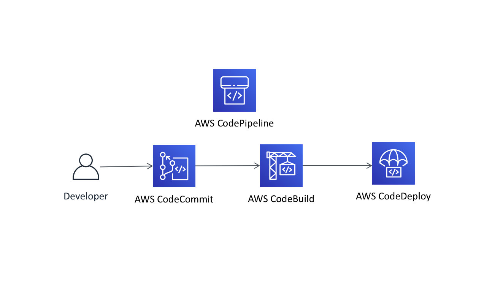

### CodeCommit

- Repository는 이전 [예제](https://github.com/toule/aws-ecs-sample/tree/master/deploy-ecs)를 참조

### CodeBuild

#### Nginx

##### Environment variables 추가

- CONTAINER_PORT 80
- TASK_FAMILY web-task

#### Tomcat

##### Environment variables 추가

- CONTAINER_PORT 8080
- TASK_FAMILY was-task

### CodeDeploy

- CodeDeploy로 배포를 하기 위해서 ECS에서 서비스를 새로 생성해야하며 이를 통해 간편하게 만들 수 있음

#### ECS Service 생성

##### Nginx

- Launch type: EC2
- Task Definition: web-task
- Cluster: Sample-cluster
- Service name: nginx-SVC
- Service type: REPLICA
- Number of tasks: 2
- Deployment: Blue/green deployment
- Service role for CodeDeploy: codedeploy_role

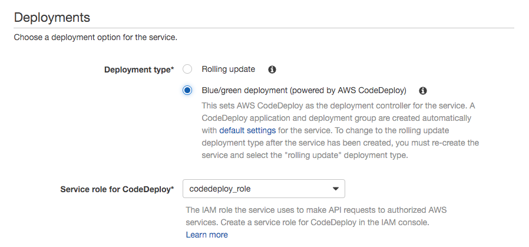

- Load balancer type: Application Load Balancer

- Service IAM role: ecsServiceRole

- Load balancer name: nginx-ALB

- Container name: port (nginx-container:0:80)

- Container to load blance

  - Production listener port: 80:HTTP
  - Test listener: Disabled
  - Target group 1 name: nginx-tg
  - Target group 2 name: create new (name: nginx-tg-1)

- Service discovery: Disabled

- Service Auto Scaling: Do not adjust

  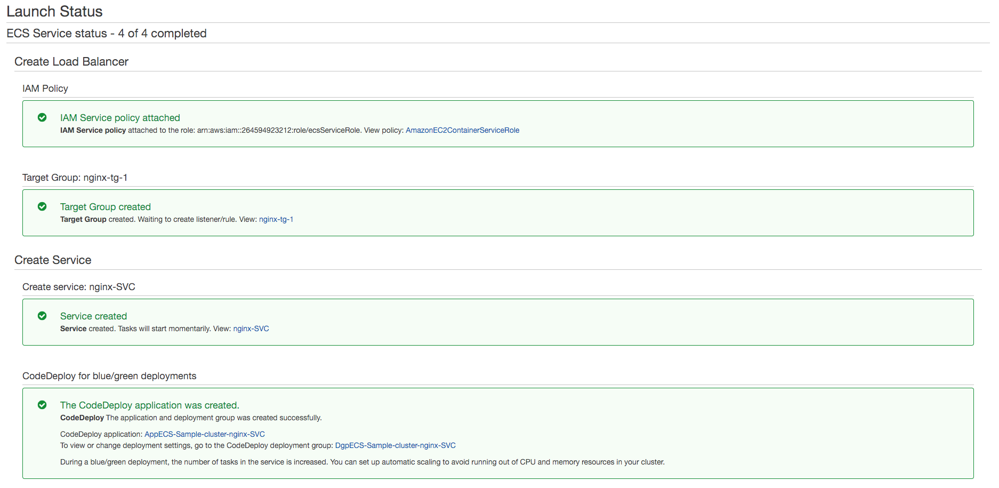

##### Tomcat

- Task Definition: was-task
- Service name: tomcat-SVC
- Number of tasks: 2
- Load balancer name: tomcat-ALB
- Container name: port (tomcat-container:0:8080)
- Container to load blance
  - Target group 1 name: tomcat-tg
  - Target group 2 name: create new (name: tomcat-tg-1)

##### CodeDeploy 수정

- 빠른 결과 확인을 위해 설정을 변경
- CodeDeploy -> Applications -> AppECS-Sample-cluster-(nginx/tomcat)-SVC -> Deployment groups -> Edit
  - Original revision termination: 1 Hours -> 0 Minute
- Rollbacks: Roll back when a deployment fails

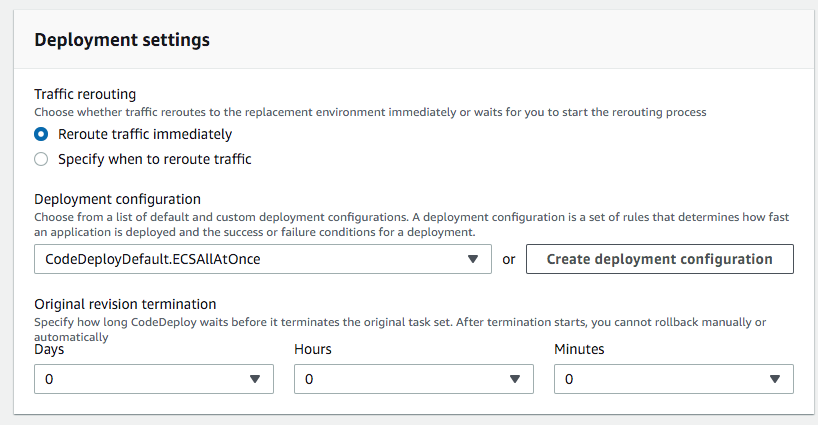

#### Pipeline 수정

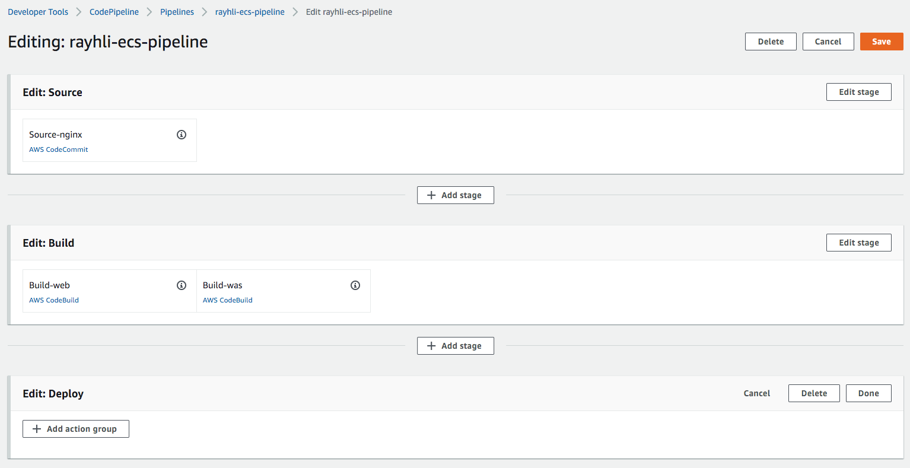

##### Nginx

- Edit -> Add action group
  - Action name: Deploy-nginx
  - Action provider: Amazon ECS (Blue/Green)
  - Input artifacts: BuildArtifact-web
  - AWS CodeDeploy application name: AppECS-Sample-cluster-nginx-SVC
  - AWS CodeDeploy deployment group: DgpECS-Sample-cluster-nginx-SVC
  - Amazon ECS task definition: BuildArtifact-web, taskdef.json
  - AWS CodeDeploy AppSpec file: BuildArtifact-web, appspec.yaml
  - Dynamically update task definition image: BuildArtifact-web, IMAGE1_NAME

##### Tomcat

- Edit -> Add action
  - Action name: Deploy-tomcat
  - Action provider: Amazon ECS (Blue/Green)
  - Input artifacts: BuildArtifact-web
  - AWS CodeDeploy application name: AppECS-Sample-cluster-tomcat-SVC
  - AWS CodeDeploy deployment group: DgpECS-Sample-cluster-tomcat-SVC
  - Amazon ECS task definition: BuildArtifact-web, taskdef.json
  - AWS CodeDeploy AppSpec file: BuildArtifact-web, appspec.yaml
  - Dynamically update task definition image: BuildArtifact-web, IMAGE1_NAME

## Test

- 현 디렉토리에 my-nginx와 my-tomcat을 복사하고 레포지토리에 commit 진행

### Result

- start

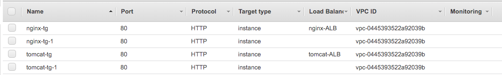

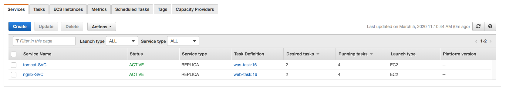

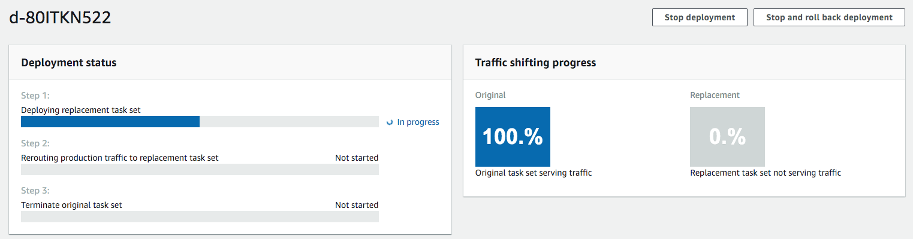

- finish

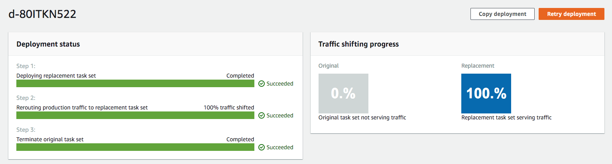

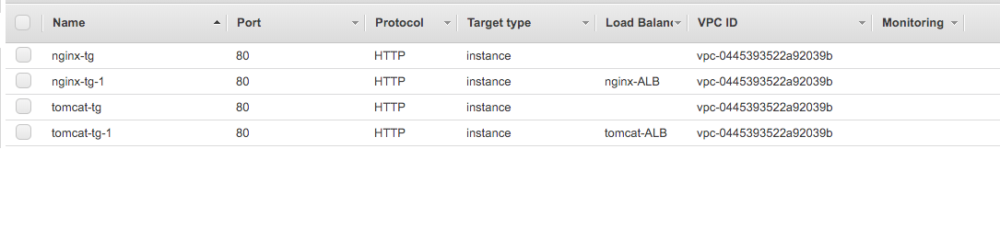

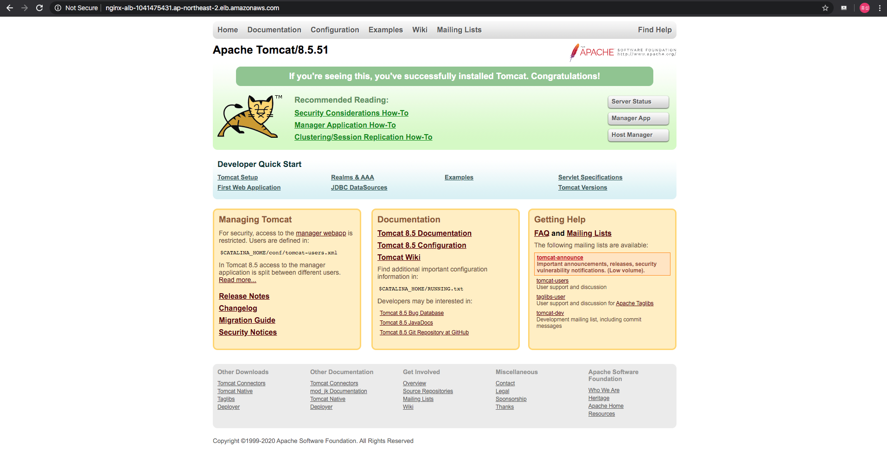

