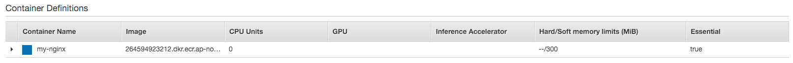
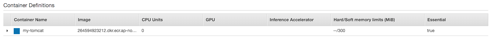
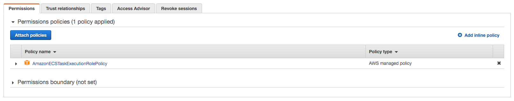

# AWS ECS CI/CD Sample Test (Rolling Update)

## 가정 상황

- 앞서 진행한 ECS 클러스터(Sample-cluster)를 기반으로 진행
- 현 문서에서 role 혹은 설정이 없는 것은 이전 문서에 있는 값을 그대로 가져옴
- CI/CD 파이프라인 구성은 다음 [예제](https://github.com/toule/aws-cicd-sample)를 참조

## 수정 사항

- buildspec.yaml파일의 단일화를 위해 Task의 컨테이너 이름을 image repo name으로 수정 (Service를 지우고 새로 생성)
  - nginx-container -> my-container
  - tomcat-container -> my-tomcat

1. web-task

2. was-task

- 결과 확인을 위해 task의 수 조절
  - web-task: 3 -> 2
  - was-task: 4 -> 2

## 준비 사항

### IAM

#### Codebuild Custom Role

- Role name: codebuild-custom-role
- Codebuild role 생성

- Attach permissions policies
  - AmazonS3FullAccess
  - AWSCodeBuildDeveloperAccess
  - CloudWatchLogsFullAccess
  - AmazonEC2ContainerRegistryPowerUser

#### ECS Task Role

- Role name: ecsTaskExecutionRole
- Attach permissions policies
  - AmazonECSTaskExecutionRolePolicy

## Pipeline 구성

### CodeCommit

- Repository name: ecs-repo

### CodeBuild

#### 고려 사항

- nginx와 tomcat이 하나의 파이프라인에서 동작해야 하기 때문에 두개의 build setting이 필요

#### Nginx

- Project name: ecs-rayhli-web-build
- Source Provider: AWS CodeCommit
- Repository: ecs-repo
- Environment image: Managed image
- Operation system: Amazon Linux 2
- Service role: codebuild-custom-role
- Addtional configuratoin
  - AWS_DEFAULT_REGION: ap-northeast-2
  - MY_ACCOUNT_ID: <my_account_id> (계정 넘버를 기입)
  - IMAGE_REPO_NAME: my-nginx
  - DOCKERFILE_PATH: my-nginx

- 나머지는 Default

#### Tomcat

- Project name: ecs-rayhli-was-build
- Source Provider: AWS CodeCommit
- Repository: ecs-repo
- Environment image: Managed image
- Operation system: Amazon Linux 2
- Service role: codebuild-custom-role
- Addtional configuratoin
  - AWS_DEFAULT_REGION: ap-northeast-2
  - MY_ACCOUNT_ID: <my_account_id> (계정 넘버를 기입)
  - IMAGE_REPO_NAME: my-tomcat
  - DOCKERFILE_PATH: my-tomcat
- 나머지는 Default

### CodePipeline

- Pipeline name: rayhli-ecs-pipeline
- Service role: New service role

#### Source

- Source provider: AWS CodeCommit
- Repository name: ecs-repo
- Branch name: master
- Change detection options: Amazon CloudWatch Events

#### Build

- 참고: 현재는 nginx의 파이프 라인만 추가하고 추후에 tomcat에 관련 부분을 추가함
- Build provider: AWS CodeBuild
- Project name: ecs-rayhli-web-build

#### Deploy

- Deploy provider: Amazon ECS
- Region: Asia Pacific (Seoul)
- Cluster name: Sample-cluster
- Service name: nginx-SVC
- Image definitions file: imagedefinitions.json

#### Edit Pipeline

- rayhli-ecs-pipeline -> edit

##### Build Stage

###### Exit Build

- Edit: Build -> Edit stage -> 기존 build edit
- Action name: Build-web
- Variable namespace: BuildVariables-web
- Output artifacts: BuildArtifact-web

###### New Build

- Edit: Build -> Edit stage -> Add action
- Action name: Build-was
- Input artifacts: SourceArtifact
- Project name: ecs-rayhli-was-build
- Variable namespace: BuildVariables-was
- Output artifacts: BuildArtifact-was

##### Deploy (ECS)

###### Exit Deploy

- Edit: Deploy -> Edit stage -> 기존 deploy edit
- Action name: Deploy-web
- Input artifacts: BuildArtifact-web
- Image definitions file: imagedefinitions.json
- Variable namespace: DeployVariables-web

###### New Deploy

- Edit: Deploy -> Edit stage -> Add action
- Action name: Deploy-was
- Action provider: Amazon ECS
- Region: Asia Pacific (Seoul)
- Input artifacts: BuildArtifact-was
- Cluster name: Sample-cluster
- Service name: tomcat-service
- Image definitions file: imagedefinitions.json
- Variable namespace: DeployVariables-was

###### result

## Test

### 준비 상황

