# AWS ECS CI/CD Sample Test (Rolling Update)

## 가정 상황

- 앞서 진행한 ECS 클러스터(Sample-cluster)를 기반으로 진행
- 현 문서에서 role 혹은 설정이 없는 것은 이전 문서에 있는 값을 그대로 가져옴
- 루트 디렉토리에서 my-nginx와 my-tomcat을 **<u>현 디렉토리에 복사</u>**해야함
- CI/CD 파이프라인 구성은 다음 [예제](https://github.com/toule/aws-cicd-sample)를 참조

## 참고 사항

- Microserivce Architecture상으로 각 서비스 별로 파이프라인을 구성하는 것이 올바르지만 현 예제는 테스트를 위해서 stage별로 parallel하게 구성하였음

## 수정 사항

- 결과 확인을 위해 task의 수 조절
  - web-task: 3 -> 2
  - was-task: 4 -> 2

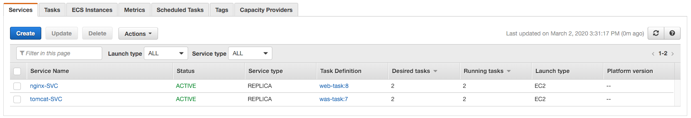

## 준비 사항

### IAM

#### Codebuild Custom Role

- Role name: codebuild-custom-role
- Codebuild role 생성

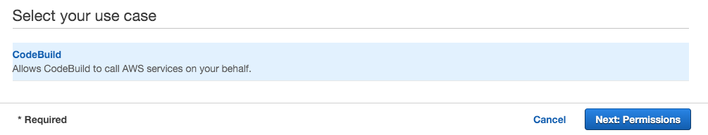

- Attach permissions policies
  - AmazonS3FullAccess
  - AWSCodeBuildDeveloperAccess
  - CloudWatchLogsFullAccess
  - AmazonEC2ContainerRegistryPowerUser

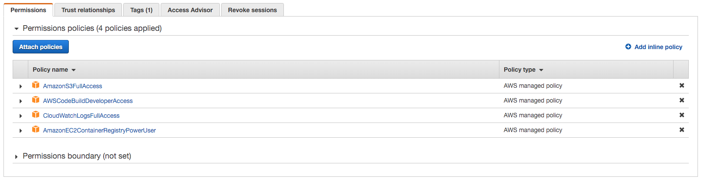


## Pipeline 구성

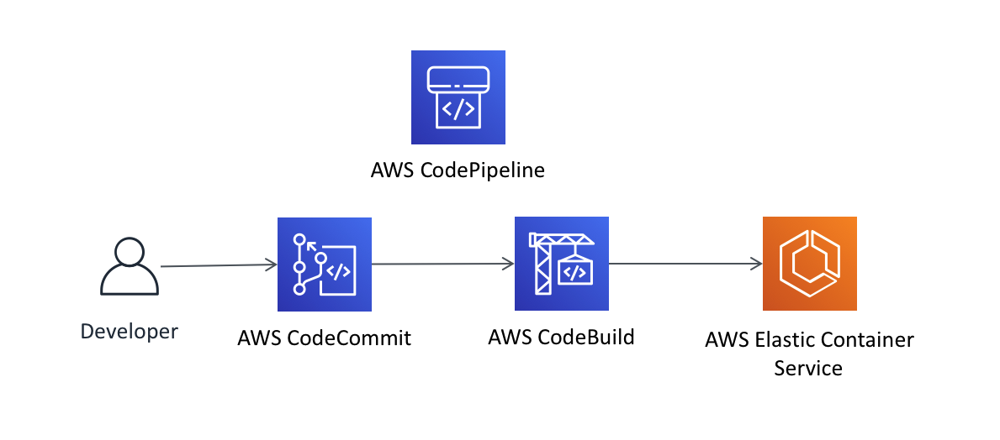

### CodeCommit

- Repository name: ecs-repo

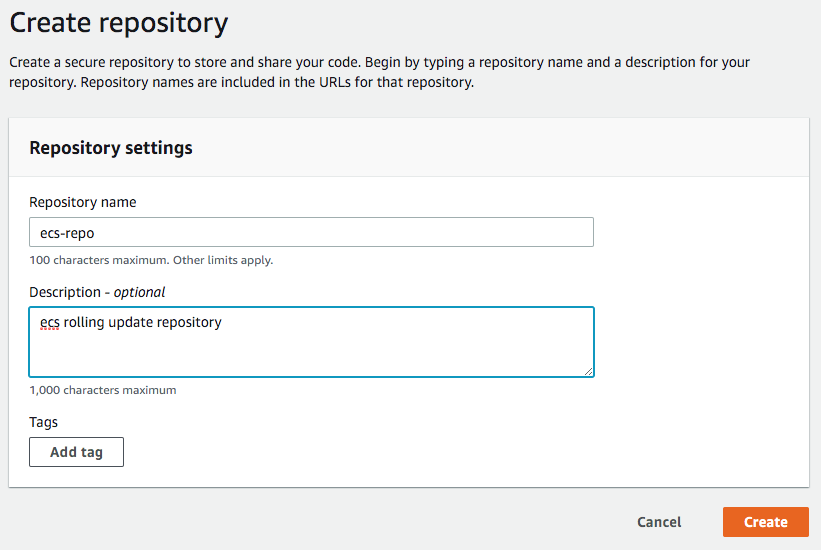

### CodeBuild

#### 고려 사항

- nginx와 tomcat이 하나의 파이프라인에서 동작해야 하기 때문에 두개의 build setting이 필요
- account id에 대해서는 Plaintext보다는 parameter store나 secret manager를 활용하는 것을 권고함

#### Nginx

- Project name: ecs-rayhli-web-build
- Source Provider: AWS CodeCommit
- Repository: ecs-repo
- Environment image: Managed image
- Operation system: Amazon Linux 2
- Service role: codebuild-custom-role
- Addtional configuratoin
  - AWS_DEFAULT_REGION: ap-northeast-2
  - MY_ACCOUNT_ID: <my_account_id> (계정 넘버를 기입)
  - IMAGE_REPO_NAME: my-nginx
  - DOCKERFILE_PATH: my-nginx
  - CONTAINER_NAME: nginx-container

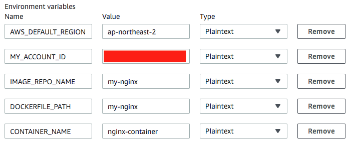

- 나머지는 Default

#### Tomcat

- Project name: ecs-rayhli-was-build
- Source Provider: AWS CodeCommit
- Repository: ecs-repo
- Environment image: Managed image
- Operation system: Amazon Linux 2
- Service role: codebuild-custom-role
- Addtional configuratoin
  - AWS_DEFAULT_REGION: ap-northeast-2
  - MY_ACCOUNT_ID: <my_account_id> (계정 넘버를 기입)
  - IMAGE_REPO_NAME: my-tomcat
  - DOCKERFILE_PATH: my-tomcat
  - CONTAINER_NAME: tomcat-container
- 나머지는 Default


### CodePipeline

- Pipeline name: rayhli-ecs-pipeline
- Service role: New service role

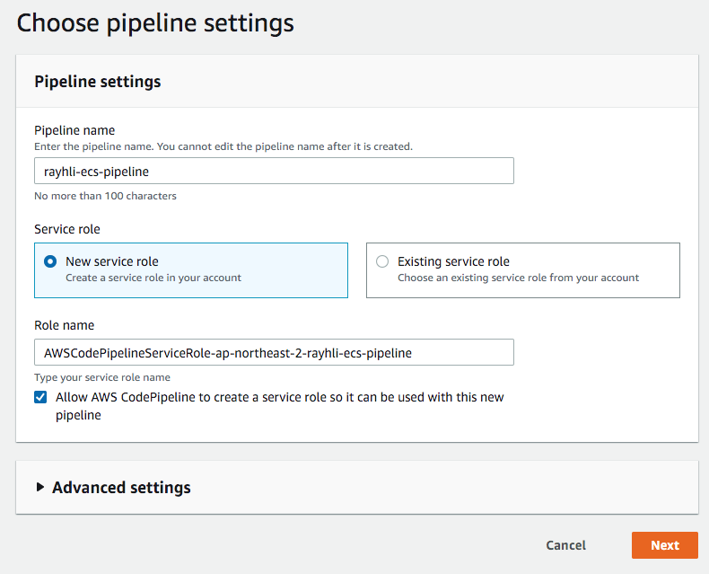

#### Source

- Source provider: AWS CodeCommit
- Repository name: ecs-repo
- Branch name: master
- Change detection options: Amazon CloudWatch Events

#### Build

- 참고: 현재는 nginx의 파이프 라인만 추가하고 추후에 tomcat에 관련 부분을 추가함
- Build provider: AWS CodeBuild
- Project name: ecs-rayhli-web-build

#### Deploy

- Deploy provider: Amazon ECS
- Region: Asia Pacific (Seoul)
- Cluster name: Sample-cluster
- Service name: nginx-SVC
- Image definitions file: imagedefinitions.json

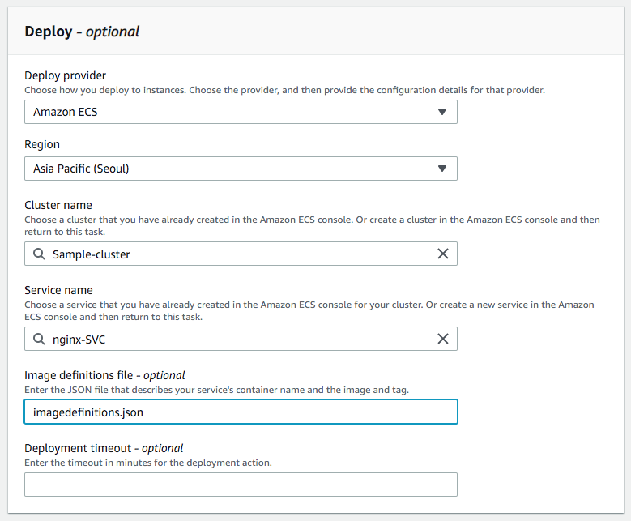

#### Edit Pipeline

- rayhli-ecs-pipeline -> edit

##### Build Stage

###### Exit Build

- Edit: Build -> Edit stage -> 기존 build edit
- Action name: Build-web
- Variable namespace: BuildVariables-web
- Output artifacts: BuildArtifact-web

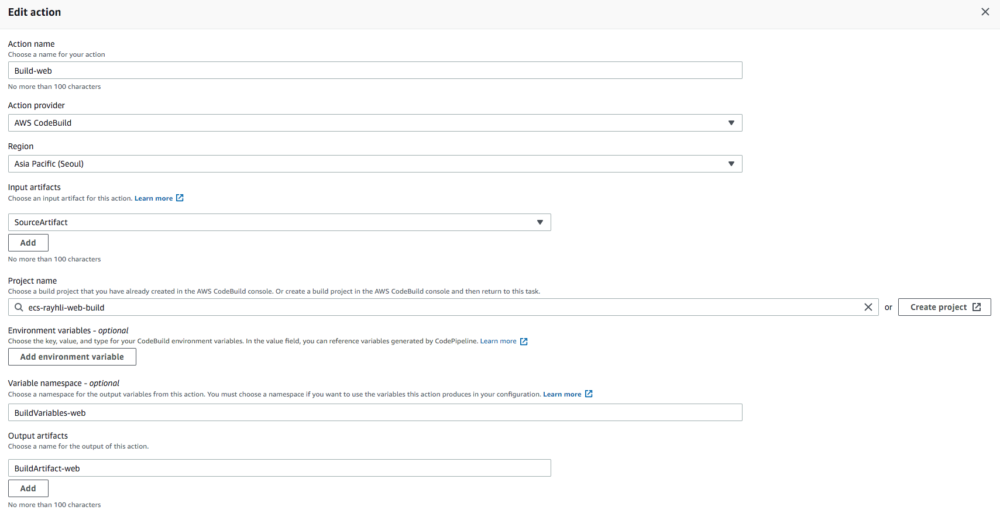

###### New Build

- Edit: Build -> Edit stage -> Add action
- Action name: Build-was
- Input artifacts: SourceArtifact
- Project name: ecs-rayhli-was-build
- Variable namespace: BuildVariables-was
- Output artifacts: BuildArtifact-was

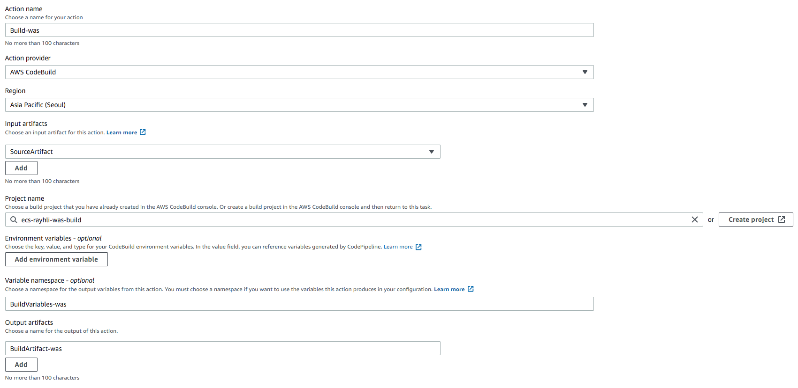

##### Deploy (ECS)

###### Exit Deploy

- Edit: Deploy -> Edit stage -> 기존 deploy edit
- Action name: Deploy-web
- Input artifacts: BuildArtifact-web
- Image definitions file: imagedefinitions.json
- Variable namespace: DeployVariables-web

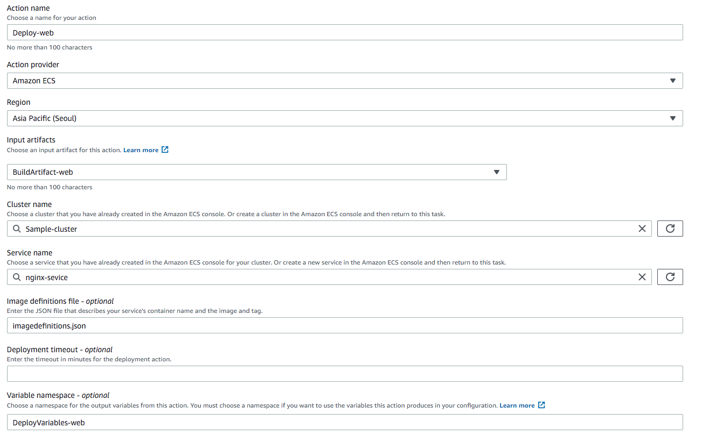

###### New Deploy

- Edit: Deploy -> Edit stage -> Add action
- Action name: Deploy-was
- Action provider: Amazon ECS
- Region: Asia Pacific (Seoul)
- Input artifacts: BuildArtifact-was
- Cluster name: Sample-cluster
- Service name: tomcat-service
- Image definitions file: imagedefinitions.json
- Variable namespace: DeployVariables-was

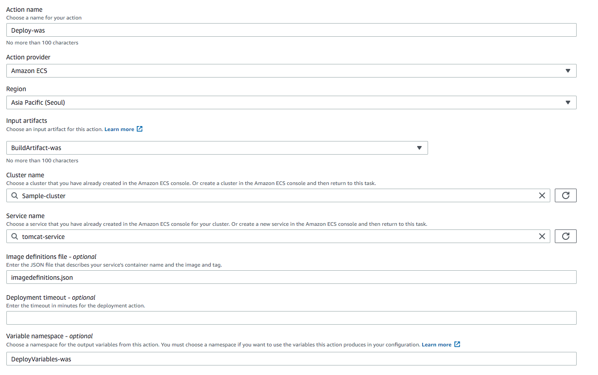

###### confirm

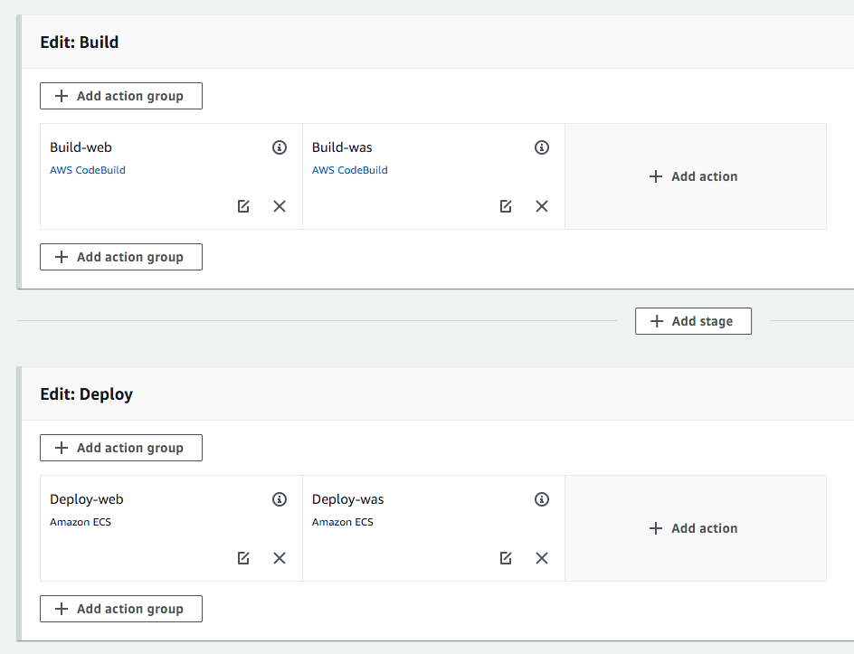

## Test

- git과 관련된 flow는 다음 [예제](https://github.com/toule/aws-cicd-sample/tree/master/django)를 참조
- IAM User를 소유하고 있고 자격증명을 완료한 상황(aws configure)
- IAM 자격증명이 안되는 경우 codecommit에 대한 credential은 있어야함

### Repository Set

```bash
git init
git remote add origin <my-repository-address>
git remote get-url --all origin
```

### Git Commit

```bash
git add .
git commit -m "inital commit"
git push origin master
```

### Result

#### Rolling Update

- ECS Rolling Update (task버전에 업데이트 되었으며 현재 이전버전과 함께 같이 동작 중)

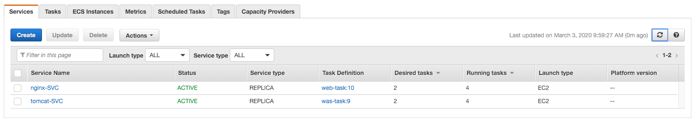

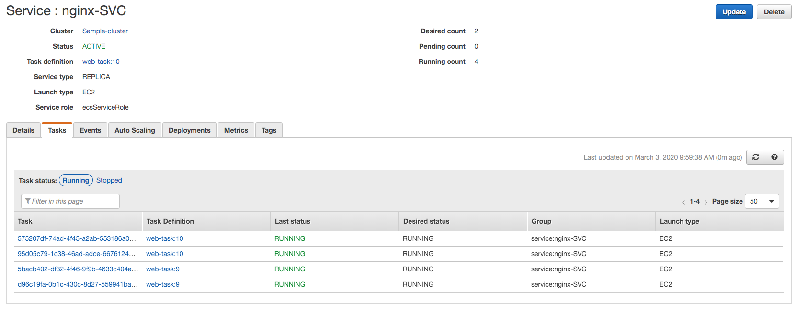

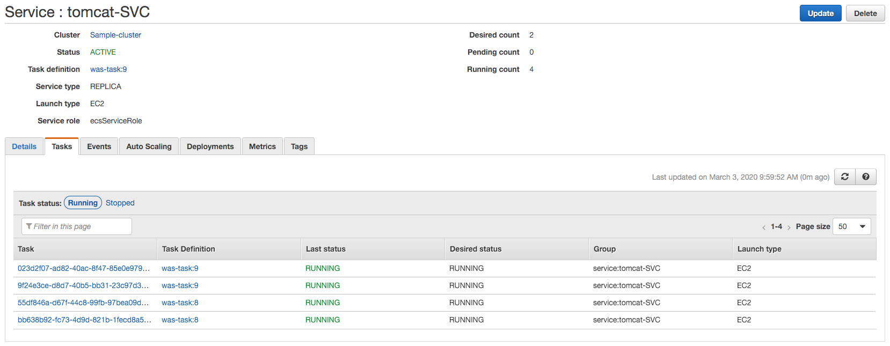

- Load Balancer에서는 이전 버전의 Task를 Draining

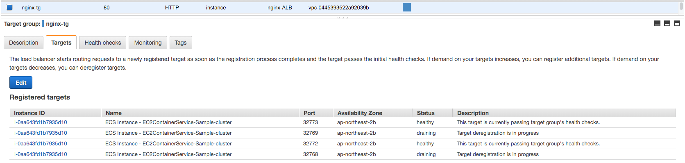

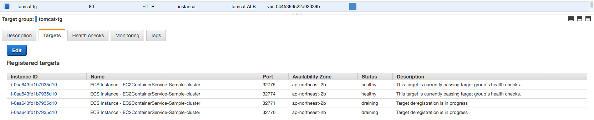

#### Pipeline


#### Result

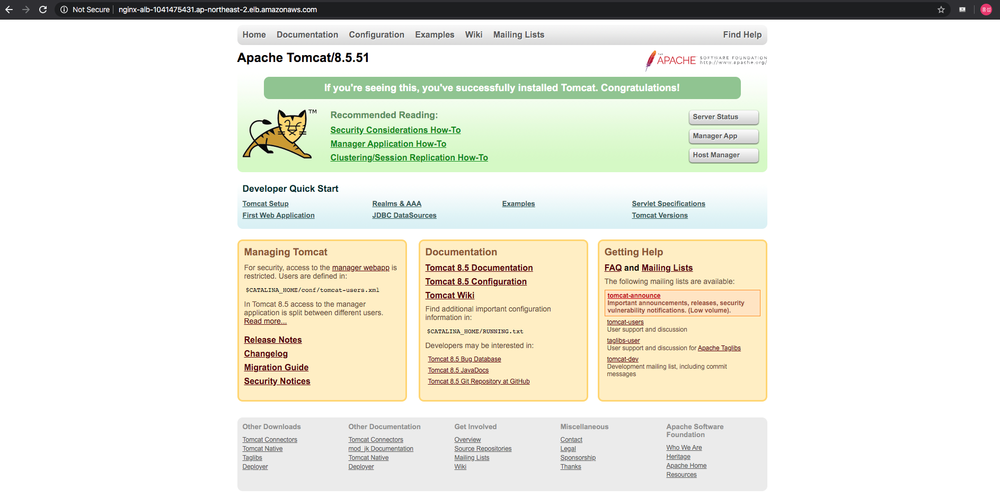